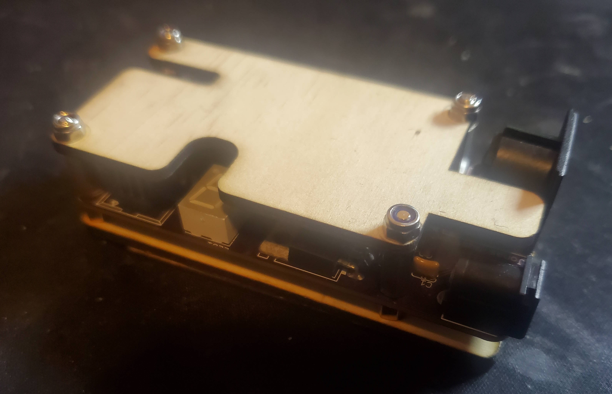
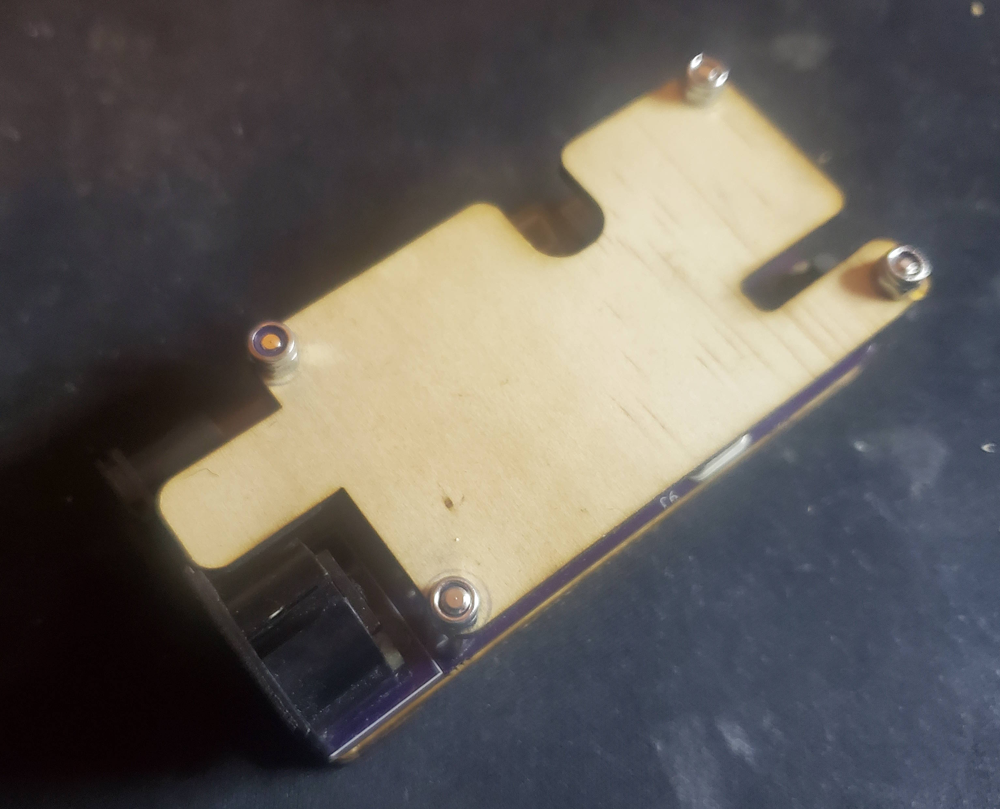
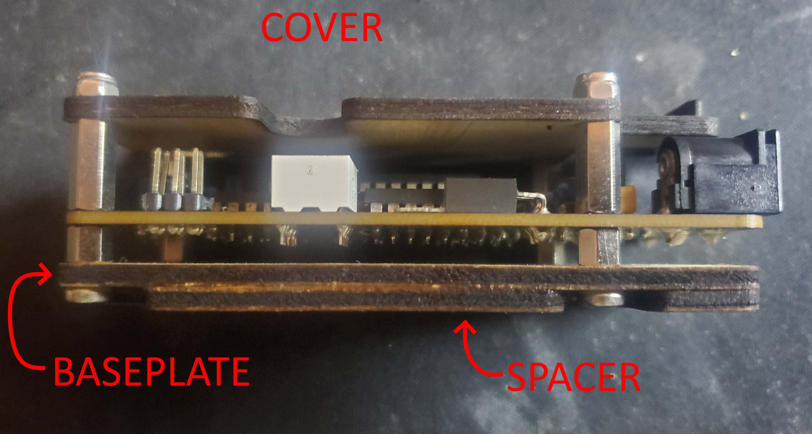
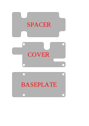

# Arcano NES Chiptune Synth Case

A simple case/cover for the Arcano NES Chiptune Synth.

Design is intended to be lazer cut from 3mm acrylic, plywood, MDF, etc. Don't cut the text.

The `cover` goes over the synth board, the `baseplate` goes under it and the `spacer` goes under the `baseplate`, to give it some extra height so that the screws don't touch the desk. The whole thing is head together with:

* four M3 screws
* four M3 nuts
* four M3 short standoffs
* four M3 medium length standoffs

See the 3rd photo below for more details.

